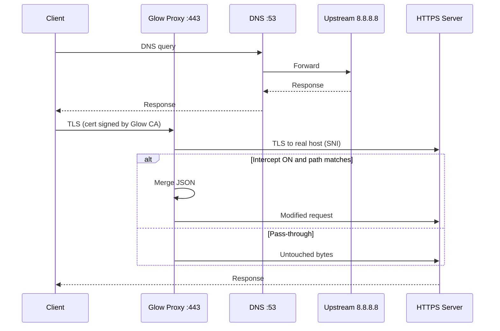

<div align="center">

# ✦ Glow Proxy

**TLS MITM proxy for Windows with real-time JSON interception**

[](https://nodejs.org/)
[](https://www.typescriptlang.org/)
[](https://www.microsoft.com/windows)
[](LICENSE)

*Local DNS · dynamic certificates · interactive console menu*

[Discord](https://discord.gg/Q4hEVkJ67J) · [Glow Launcher](https://github.com/)

</div>

---

## What does it do?

**Glow Proxy** redirects your PC’s HTTPS traffic through a local proxy on `:443`, terminates TLS with on-the-fly generated certificates, and when enabled, **patches the JSON body** of HTTP requests that match a configurable route.

Built for development and testing with HTTPS clients (e.g. `world/info`-style requests), without touching game binaries: only network and JSON.

```
  Client (game/app)
        │
        ▼  DNS → 127.0.0.1
  ┌─────────────────┐
  │  Glow Proxy     │
  │  :53  DNS fwd   │──────► 8.8.8.8 / Google DNS
  │  :443 TLS MITM  │
  └────────┬────────┘
           │  intercept OFF → transparent tunnel
           │  intercept ON  → merge JSON and forward
           ▼
     Real server (HTTPS)
```

---

## Features

| | |
|---|---|
| 🔐 **TLS MITM** | Own CA + per-`SNI` (hostname) leaf certificates, with caching |
| 🌐 **Local DNS** | Listens on `0.0.0.0:53` and forwards queries to Google DNS |
| ⚙️ **Windows DNS** | Sets the active adapter to `127.0.0.1` and restores on exit |
| 📝 **JSON patch** | Merges a `.json` file over the body of routes you choose |
| 🖥️ **TUI menu** | Console with ANSI colors, stats, and keyboard shortcuts |
| 🛡️ **Elevation** | Relaunches itself as administrator when needed |

---

## Requirements

- **Windows 10/11** (64-bit)
- **Node.js 18+**
- **Administrator privileges** (ports 53 and 443, `certutil`, `netsh`)
- Terminal with **ANSI** support (Windows Terminal, modern ConHost)

> ⚠️ Does not work on Linux/macOS: it uses `netsh`, `certutil`, and the Windows certificate store.

---

## Installation

```bash
git clone https://github.com/YOUR_USER/glow-proxy.git
cd glow-proxy
npm install
```

Main dependencies: `node-forge`, `typescript`, `ts-node`.

---

## Quick start

1. Open **PowerShell or CMD as administrator** (or let the script request elevation).
2. In the project folder:

```bash
npx ts-node proxy.ts
```

3. On startup, a dialog opens to choose the **JSON patch file**.
4. The first time, `proxy-ca.crt` / `proxy-ca.key` are generated and the CA is installed in the Windows **Trusted Root** store.
5. Use the menu to enable intercept, set the route, and relaunch if you change the JSON.

### Build (optional)

```bash
npx tsc proxy.ts --target ES2020 --module commonjs --esModuleInterop
node proxy.js
```

---

## Interactive menu

```
  ┌─────────────────────────────────────────────┐
  │ Glow Proxy    https://discord.gg/Q4hEVkJ67J │
  └─────────────────────────────────────────────┘

  [1] Intercept: ON / OFF
  PATH:       /path/to/intercept
  JSON:       patches.json
  STATS:      N intercepted / M total

  [2]  Change intercept path
  [3]  Select another JSON file
  [4] / Q  Exit (restores DNS)
```

| Key | Action |
|-----|--------|
| `1` | Toggle interception on / off |
| `2` | Enter the URL path (substring) to intercept |
| `3` | Opens the Windows file picker |
| `4` / `Q` / `Ctrl+C` | Exit and **restore DNS to DHCP** |

With **Intercept OFF**, the proxy does transparent **pass-through** (only logs hosts).

---

## Patch JSON format

The file must be a **plain JSON object**. On each intercepted request, the proxy:

1. Parses the request body as JSON.
2. Runs `Object.assign(body, patches)` with your file.
3. Forwards the request with the updated `Content-Length`.

**Example** `patches.json`:

```json
{
  "bIsEnabled": true,
  "customField": "test value"
}
```

Patches are only applied when:

- Intercept is **ON**
- The configured route appears in the HTTP request line (e.g. `/fortnite/api/game/v2/world/info`)
- The request has a complete JSON body in the first message

---

## How it works (internals)



1. **CA** — RSA-2048, saved to disk or reused; `basicConstraints: CA` extension.
2. **Leaf certs** — One certificate per hostname (`subjectAltName`), signed by the CA; in-memory cache.
3. **DNS** — Your active adapter points to `127.0.0.1`; the proxy forwards to `8.8.8.8` / `2001:4860:4860::8888`.
4. **Clean shutdown** — `restoreWindowsDNS()` + `ipconfig /flushdns` on exit.

---

## Generated files

| File | Description |
|------|-------------|
| `proxy-ca.crt` | CA certificate (public) |
| `proxy-ca.key` | CA private key — **do not upload this to GitHub** |
| `_proxy_admin.bat` | Temporary elevation script (self-deletes) |

Add to `.gitignore`:

```gitignore
proxy-ca.key
proxy-ca.crt
_proxy_admin.bat
node_modules/
```

---

## Uninstall / revert

1. Close the proxy with `Q` or `Ctrl+C` (DNS is restored automatically).
2. To remove the CA from the system:

```powershell
certutil -delstore root "FortniteProxy CA"
```

3. Delete `proxy-ca.crt` and `proxy-ca.key` if you no longer need them.

---

## Troubleshooting

| Symptom | What to try |
|---------|-------------|
| `DNS server failed` | Another service is using port 53 (disable DNS in Hyper-V, local Pi-hole, etc.) |
| `TLS proxy listen failed` | Port 443 in use (IIS, another proxy, legacy Skype) |
| `certutil failed` | Run as administrator |
| Menu does not respond | Use a real terminal (TTY), not stdin redirection |
| Certificate not trusted | Check that `FortniteProxy CA` is in **Trusted Root Certification Authorities** |

---

## Legal notice and security

This software performs **TLS inspection (MITM)** and installs a **custom certificate authority** on Windows. Use it only on **machines and traffic you control**, for **development, debugging, or authorized research**.

- Do not use Glow Proxy on foreign networks or to intercept third-party data without permission.
- The `proxy-ca.key` file can sign certificates trusted by your system: treat it as a secret.
- The author is not responsible for misuse of the project.

---

## Credits

Part of the **[Glow Launcher](https://discord.gg/Q4hEVkJ67J)** ecosystem.

- [node-forge](https://github.com/digitalbazaar/forge) — cryptography and X.509  
- Node.js `tls`, `dgram`, `net` — server and sockets  

---

<div align="center">

**Made with ☕ for the Glow community**

If it helps you, ⭐ the repo.

</div>
