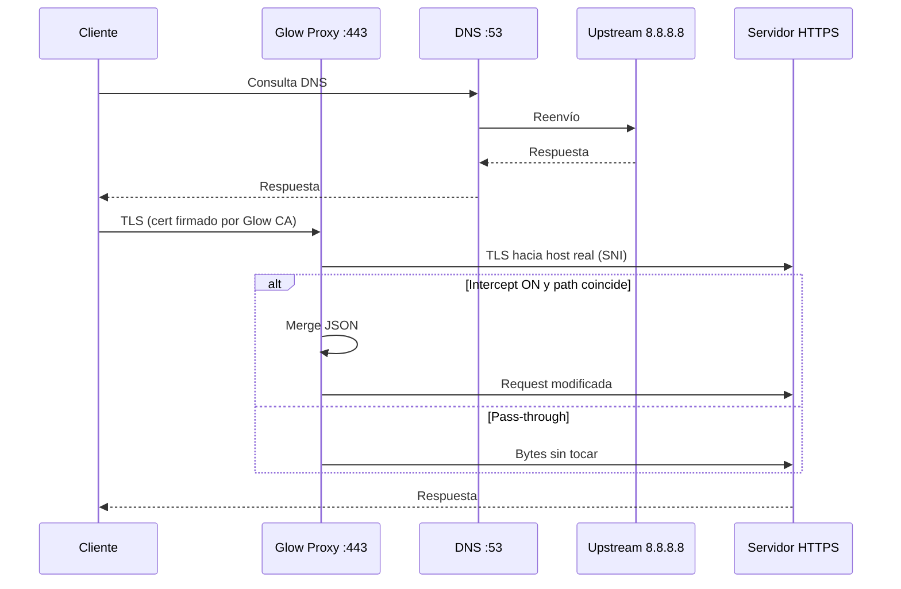

<div align="center">

# ✦ Glow Proxy

**Proxy TLS MITM para Windows con interceptación JSON en tiempo real**

[](https://nodejs.org/)
[](https://www.typescriptlang.org/)
[](https://www.microsoft.com/windows)
[](LICENSE)

*DNS local · certificados dinámicos · menú interactivo en consola*

[Discord](https://discord.gg/Q4hEVkJ67J) · [Glow Launcher](https://github.com/STWJXSX/Glow-Launcher)

</div>

---

## ¿Qué hace?

**Glow Proxy** redirige el tráfico HTTPS de tu PC a través de un proxy local en `:443`, termina TLS con certificados generados al vuelo y, cuando lo activas, **parchea el body JSON** de peticiones HTTP que coincidan con una ruta configurable.

Pensado para desarrollo y pruebas con clientes que hablan HTTPS (p. ej. peticiones tipo `world/info`), sin tocar binarios del juego: solo red y JSON.

```
  Cliente (juego/app)
        │
        ▼  DNS → 127.0.0.1
  ┌─────────────────┐
  │  Glow Proxy     │
  │  :53  DNS fwd   │──────► 8.8.8.8 / Google DNS
  │  :443 TLS MITM  │
  └────────┬────────┘
           │  intercept OFF → túnel transparente
           │  intercept ON  → merge JSON y reenvío
           ▼
     Servidor real (HTTPS)
```

---

## Características

| | |
|---|---|
| 🔐 **MITM TLS** | CA propia + certificados de hoja por `SNI` (hostname), con caché |
| 🌐 **DNS local** | Escucha en `0.0.0.0:53` y reenvía consultas a Google DNS |
| ⚙️ **DNS de Windows** | Configura el adaptador activo a `127.0.0.1` y restaura al salir |
| 📝 **Patch JSON** | Fusiona un fichero `.json` sobre el body de rutas que elijas |
| 🖥️ **Menú TUI** | Consola con colores ANSI, estadísticas y atajos de teclado |
| 🛡️ **Elevación** | Se relanza solo como administrador si hace falta |

---

## Requisitos

- **Windows 10/11** (64-bit)
- **Node.js 18+**
- **Permisos de administrador** (puertos 53 y 443, `certutil`, `netsh`)
- Terminal con soporte **ANSI** (Windows Terminal, ConHost moderno)

> ⚠️ No funciona en Linux/macOS: usa `netsh`, `certutil` y el almacén de certificados de Windows.

---

## Instalación

```bash
git clone https://github.com/TU_USUARIO/glow-proxy.git
cd glow-proxy
npm install
```

Dependencias principales: `node-forge`, `typescript`, `ts-node`.

---

## Uso rápido

1. Abre **PowerShell o CMD como administrador** (o deja que el script pida elevación).
2. En la carpeta del proyecto:

```bash
npx ts-node proxy.ts
```

3. Al arrancar se abre un diálogo para elegir el **fichero JSON** de parches.
4. La primera vez se generan `proxy-ca.crt` / `proxy-ca.key` y se instala la CA en el almacén **Trusted Root** de Windows.
5. Usa el menú para activar intercept, definir la ruta y relanzar si cambias el JSON.

### Compilar (opcional)

```bash
npx tsc proxy.ts --target ES2020 --module commonjs --esModuleInterop
node proxy.js
```

---

## Menú interactivo

```
  ┌─────────────────────────────────────────────┐
  │ Glow Proxy    https://discord.gg/Q4hEVkJ67J │
  └─────────────────────────────────────────────┘

  [1] Intercept: ON / OFF
  PATH:       /ruta/a/interceptar
  JSON:       patches.json
  STATS:      N intercepted / M total

  [2]  Cambiar path de intercept
  [3]  Seleccionar otro JSON
  [4] / Q  Salir (restaura DNS)
```

| Tecla | Acción |
|-------|--------|
| `1` | Activa / desactiva la interceptación |
| `2` | Escribe la ruta URL (substring) a interceptar |
| `3` | Abre el selector de archivos de Windows |
| `4` / `Q` / `Ctrl+C` | Sale y **restaura DNS a DHCP** |

Con **Intercept OFF**, el proxy hace **pass-through** transparente (solo registra hosts).

---

## Formato del JSON de parches

El fichero debe ser un **objeto JSON plano**. En cada petición interceptada, el proxy:

1. Parsea el body de la petición como JSON.
2. Hace `Object.assign(cuerpo, parches)` con tu fichero.
3. Reenvía la petición con el `Content-Length` actualizado.

**Ejemplo** `patches.json`:

```json
{
  "bIsEnabled": true,
  "customField": "valor de prueba"
}
```

Solo se aplican parches cuando:

- Intercept está **ON**
- La ruta configurada aparece en la línea de petición HTTP (p. ej. `/fortnite/api/game/v2/world/info`)
- La petición tiene body JSON completo en el primer mensaje

---

## Cómo funciona (por dentro)



1. **CA** — RSA-2048, guardada en disco o reutilizada; extensión `basicConstraints: CA`.
2. **Leaf certs** — Un certificado por hostname (`subjectAltName`), firmado por la CA; cache en memoria.
3. **DNS** — Tu adaptador activo apunta a `127.0.0.1`; el proxy reenvía a `8.8.8.8` / `2001:4860:4860::8888`.
4. **Salida limpia** — `restoreWindowsDNS()` + `ipconfig /flushdns` al cerrar.

---

## Ficheros generados

| Archivo | Descripción |
|---------|-------------|
| `proxy-ca.crt` | Certificado de la CA (público) |
| `proxy-ca.key` | Clave privada de la CA — **no subas esto a GitHub** |
| `_proxy_admin.bat` | Script temporal de elevación (se borra solo) |

Añade a `.gitignore`:

```gitignore
proxy-ca.key
proxy-ca.crt
_proxy_admin.bat
node_modules/
```

---

## Desinstalar / revertir

1. Cierra el proxy con `Q` o `Ctrl+C` (restaura DNS automáticamente).
2. Si quieres quitar la CA del sistema:

```powershell
certutil -delstore root "FortniteProxy CA"
```

3. Borra `proxy-ca.crt` y `proxy-ca.key` si ya no los necesitas.

---

## Solución de problemas

| Síntoma | Qué probar |
|---------|------------|
| `DNS server failed` | Otro servicio usa el puerto 53 (desactiva DNS en Hyper-V, Pi-hole local, etc.) |
| `TLS proxy listen failed` | Puerto 443 ocupado (IIS, otro proxy, Skype antiguo) |
| `certutil failed` | Ejecutar como administrador |
| El menú no responde | Usar terminal real (TTY), no redirección de stdin |
| Certificado no confiado | Comprobar que `FortniteProxy CA` está en **Entidades de certificación raíz de confianza** |

---

## Aviso legal y seguridad

Este software realiza **inspección TLS (MITM)** e instala una **autoridad de certificación personal** en Windows. Úsalo solo en **máquinas y tráfico que controles**, con fines de **desarrollo, depuración o investigación autorizada**.

- No uses Glow Proxy en redes ajenas ni para interceptar datos de terceros sin permiso.
- La clave `proxy-ca.key` permite firmar certificados válidos para tu sistema: trátala como un secreto.
- El autor no se hace responsable del uso indebido del proyecto.

---

## Créditos

Parte del ecosistema **[Glow Launcher](https://discord.gg/Q4hEVkJ67J)**.

- [node-forge](https://github.com/digitalbazaar/forge) — criptografía y X.509  
- Node.js `tls`, `dgram`, `net` — servidor y sockets  

---

<div align="center">

**Hecho con ☕ para la comunidad Glow**

Si te sirve, ⭐ en el repo.

</div>
